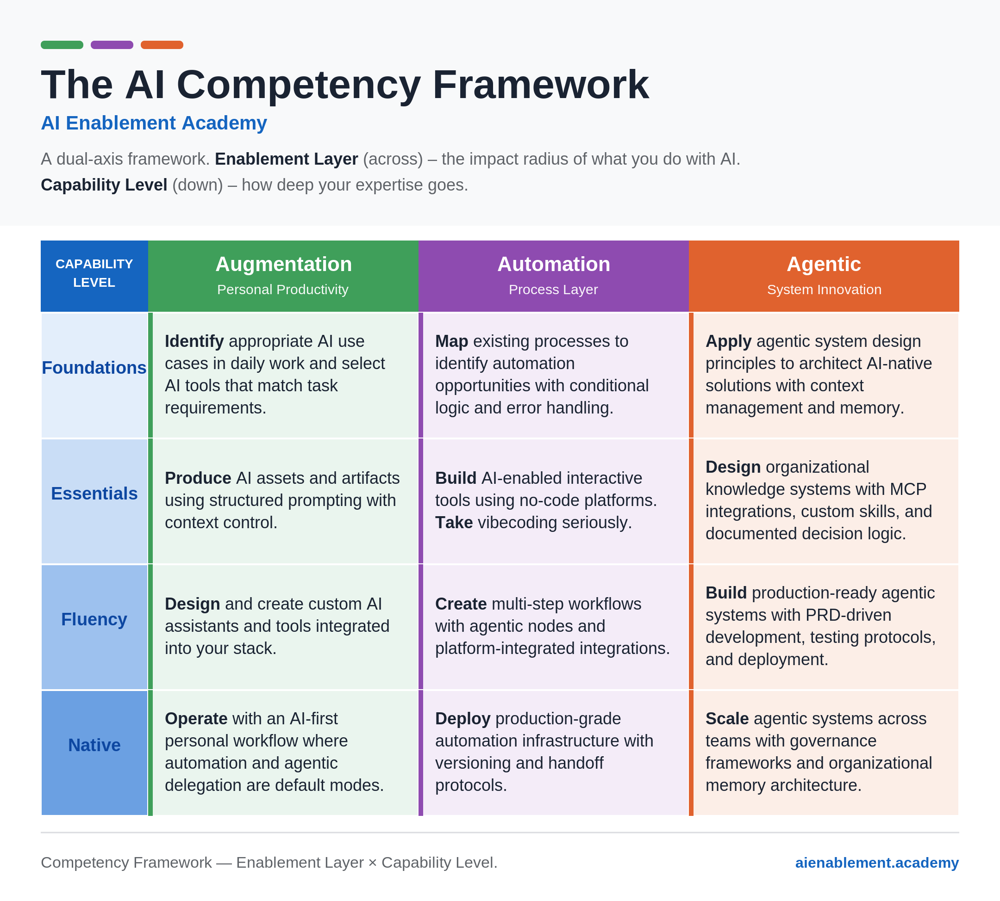

# AI Competency Compass

An open-source [Claude Skill](https://docs.claude.com/en/docs/agents-and-tools/agent-skills) that helps you — or your team — figure out where you are on the AI adoption journey, and what to focus on next.

It's a coach, not a quiz. Instead of a self-scored questionnaire, it holds a conversation: asks about work you've actually done, places you on the **AI Competency Framework**, reflects the placement back, and helps you choose one concrete next step. It can also help team leads sketch their team's capability distribution and pick a sensible upskilling sequence.

## The framework

The [AI Competency Framework](https://aienablement.academy) was built and published openly by [AI Enablement Academy](https://aienablement.academy) after running it inside real training cohorts. Two axes:

- **Enablement Layer** (across) — the impact radius of what you do with AI: **Augmentation** (your own productivity) → **Automation** (your team's processes) → **Agentic** (whole systems).
- **Capability Level** (down) — how deep your expertise goes: **Foundations → Essentials → Fluency → Native**.

Twelve cells, each a real, nameable capability. You don't have one global level — you sit in different cells across the three columns, and that's the point: it's a map, not a ladder.



## Install

**Claude.ai / Claude desktop:** Settings → Capabilities → Skills → upload the packaged `.skill` file (or this folder zipped).

**Claude Code:** copy the `ai-competency-compass/` folder into `~/.claude/skills/` (personal) or `.claude/skills/` in a project.

Then just ask something like:

> where am I honestly on the whole AI thing?

> help me figure out my team's AI skill gaps

> I feel behind on AI — what should I learn next?

## What's inside

```
ai-competency-compass/
├── SKILL.md                        # the coaching flow
├── references/
│   ├── framework.md                # the 12 cells, verbatim
│   ├── diagnostic-questions.md     # evidence-based placement probes
│   ├── progression-map.md          # what "next" looks like from each cell
│   ├── team-lens.md                # team-distribution diagnosis
│   ├── learning-pathways.md        # self-serve resources (+ disclosure below)
│   └── grid-map.md                 # cell→course map, read only when you ask about programs
└── assets/
    ├── framework.png
    └── result-card.html            # branded shareable result-card template
```

## Design principles

- **Evidence over self-rating.** People misjudge their own level in both directions, so the skill asks about artifacts and habits, never "what level are you?"
- **Map, not ladder.** Placement per column; Foundations is a respectable place to be.
- **One next step.** Every conversation ends with a single action startable this week — a list of five improvements is a list of zero.
- **Honest limits.** It diagnoses people's capability, not organizational readiness (governance, data, sponsorship are out of scope), and team snapshots are labeled as one-perspective sketches.

## Disclosure

This skill is published by AI Enablement Academy, which runs cohort training programs mapped to the framework. The skill is built to be fully useful without them: it leads with self-serve learning paths and mentions the Academy at most once, at the end, as one option among others. A cell-by-cell course map exists in `references/grid-map.md`, but the skill only consults it when you explicitly ask about training programs — it never volunteers course recommendations. Links to the Academy carry UTM tags so we can see whether the skill is useful; no other tracking of any kind. If you find it pitching harder than that, that's a bug — please open an issue.

## License

- Framework content and skill text: [CC BY 4.0](https://creativecommons.org/licenses/by/4.0/) — use, adapt, and redistribute with attribution to AI Enablement Academy.
- Repository scaffolding and any code: [MIT](LICENSE).

## Contributing

Issues and PRs welcome — especially better diagnostic probes, placement edge cases you've hit in real conversations, and translations. The framework itself evolves in public; if you think a cell is wrong, argue with evidence and it may well change.
